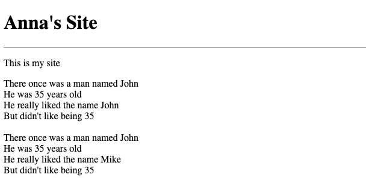
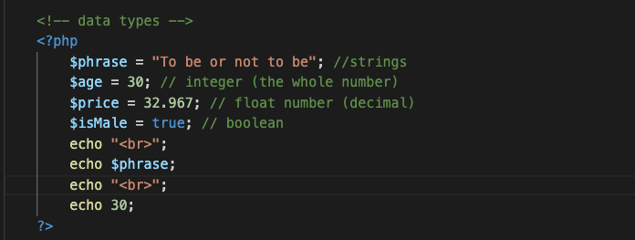
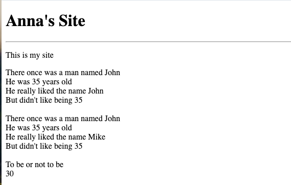
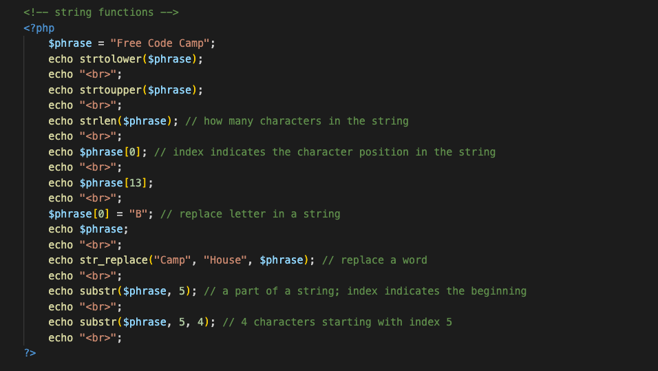
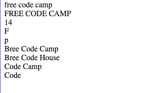

# PHP

## In Terminal
php -S localhost:4000

## Create a file
www folder

site.php file

HTML template

Inside of the body: 

    <?php
        echo("Hello World");
    ?>

in browser command line: `/www/site.php` (to open the folder and the file)

## echo
`<body>`

    <?php
        echo("Hello World");
        echo "Hello World";
        echo "<h1>Anna's Site</h1>"; //html in text
        echo "
";
        echo "
This is my site
";
    ?>

`</body>`

## Variables
    <?php
        // writing HTML
        echo "<h1>Anna's Site</h1>";
        echo "
";
        echo "
This is my site
";

        // variable
        $characterName = "John";
        $characterAge = "35";
        echo "There once was a man named $characterName  ";
        echo "He was $characterAge years old  ";
        echo "He really liked the name $characterName  ";
        echo "But didn't like being $characterAge  ";

        echo " ";
        
        // re-assign variable
        $characterName = "John";
        $characterAge = "35";
        echo "There once was a man named $characterName  ";
        echo "He was $characterAge years old  ";
        $characterName = "Mike";
        echo "He really liked the name $characterName  ";
        echo "But didn't like being $characterAge  ";
    ?>

## Data Types

 | 
|----|----|

## String Functions

 | 
|----|----|

## site.php

## site-two.php
- Arrays
- Checkboxes
- Associative Arrays